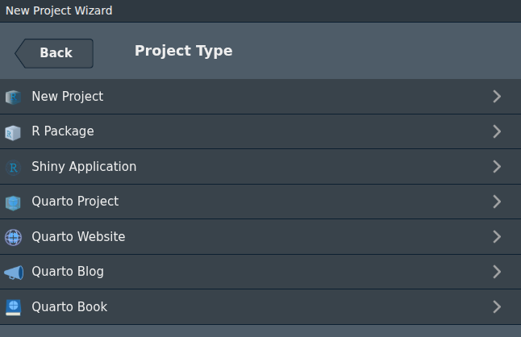

## `Quarto`


:::: {.columns}


::: {.column width="60%"}

### Create scientific notebooks ...

```{=html}
<iframe
  src="../Exercices/first_quarto_file/first_quarto_document.html"
  width="100%"
  height="600"
  style="border: 1px solid #ccc;">
</iframe>

```
:::


::: {.column width="40%"}


### With an open-source syntax and compilation system ...

```bash
quarto render Exercices/first_quarto_file/first_quarto_document.qmd

```


````

````


:::

::::


## The quarto `.qmd` format

- YAML: A key-value pairs format to store document **metadata** (title, date, format, ...)
- Chunks: Code block identified with ``{r}`` 
- [The markdown syntax](https://www.markdownguide.org/basic-syntax/)

### Gallery

```{=html}
<iframe
  src="https://quarto.org/docs/gallery/#articles-reports"
  width="100%"
  height="500"
  style="border: 1px solid #ccc;">
</iframe>

```


## YAML header

- A key-value pairs format to store document **metadata** (title, date, format, ...)


### Example

```yaml
---
title: "Hello, Quarto"
format: html
editor: visual
---
```


### How it works

```yaml
---
option1:
  option1.1:
    option1.1.1: argument
option2: argument
---
```


## Code chunks

- Code block identified with ``{r}`` 


```{r}
#| output-location: column
#| label: chunk_example
#| fig-width: 6
#| fig-height: 4
#| fig-cap: "Air Quality"

library(ggplot2)
ggplot(airquality, aes(Temp, Ozone)) + 
  geom_point() + 
  geom_smooth(method = "loess", se = FALSE)
```


## Markdown text

- [The markdown syntax](https://www.markdownguide.org/basic-syntax/)
- Quarto use markdown syntax for text, which is interpreted into html / pdf output

| Result | Markdown | Html |
|--------|----------|------|
| *Italic* | `*Italic*` or `_Italic_` | `<i>Italic</i>` or `<em>Italic</em>`|
| ***Bold & Italic*** | `***Bold & Italic***` or `___Bold & Italic___` | `<b><i>Bold & Italic</i></b>`  |
|~~Strike~~ | `~~Strike~~` | `<strike>Strike<\strike>` |
| `Inline code` | `` `Inline code` `` | `<code>Inline code<\code>` |

: From markdown to output


## How it works

{.border fig-align="center" width="100%"}

- `.qmd` is the source.
- [knitr](http://yihui.name/knitr/): chunks -> markdown.
- [pandoc](http://pandoc.org/) convert markdown into the output format.


## Installation

### Install and update

- Quarto is available as an executable here: https://quarto.org/docs/get-started/
- But available natively within Rstudio using the render button.

### Quarto is a standalone tool

- No language needed : It is not a R package (`Rmarkdown` is).

## Rendering our first document


### Quarto generate beautiful documents using raw text as template

With ...

- `quarto render`
- <kbd>{width="25" height="20"}</kbd> **Render** button in the RStudio IDE 
- `quarto::quarto_render("hello.qmd")`


## Output formats

### Single document

* Notebook / report:
  - html: an html document (open with navigator)
  - pdf: a pdf document generated using LaTeX
  - docx: Word document
  - ipynb: jupyter notebook
* Slides:
  - html: using revealjs library
  - pdf: beamer package with LaTeX
  - pptx: PowerPoint presentation
* [Dashboard](https://quarto.org/docs/dashboards/): static or interactive (with shiny)


### Multiple documents

* Website: rendering a group of documents into a single website with navigation
* Books: multi-format output for chapters into a single manuscript.
* [Quarto manuscripts](https://quarto.org/docs/manuscripts/).

## Getting started

### `.qmd` creation

From `Rstudio > File > New File > Quarto document`

### Create a project 

- used to handle multiple documents (website, blog, book, ...)

{.border fig-align="center" width="100%"}


## Work with multiple documents

When working on multiple documents, we need a `_quarto.yml` file.

:::{.fragment}
``` yaml
project:
  type: website
  title: "Rédaction de documents en Rmarkdown et Quarto"
  output-dir: docs
  execute-dir: project
  render:
    - "*.qmd"

website:
  title: "Formation Quarto"
  navbar:
    right:
      - icon: house
        href: index.qmd
        text: Home
      - icon: book
        href: https://genotoul-biostat.pages-forge.inrae.fr/website/
        text: Plateforme de Biostatistique Toulouse - Génotoul
      - icon: gitlab
        href: https://forge.inrae.fr/genotoul-biostat/formation-quarto
        aria-label: GitLab
        text: Dépôt du code source
  sidebar:
    style: "docked"
    search: true
    contents: auto
    reader-mode: true

  page-footer:
    left: "Formation Quarto"


execute:
  echo: true
  warning: false
  message: false
  freeze: auto


resources:
  - "Resources/*"
```
:::

## Deploy a quarto document

- `Github`:
  - add a `.nojekill` file : Tells github to do nothing but publishing.
  - Import your project on github (`git push`)
  - On `Settings > Pages`:
    - Deploy from a branch
    - Branch : `main` & directory `/docs`
- `Gitlab`:
  - add a `.gitlab-ci.yaml` file
  - It's done.

::: {.callout-tip appearance="minimal"}
We don't have to push source files, we just need "binaries" : html, css, ...
:::
